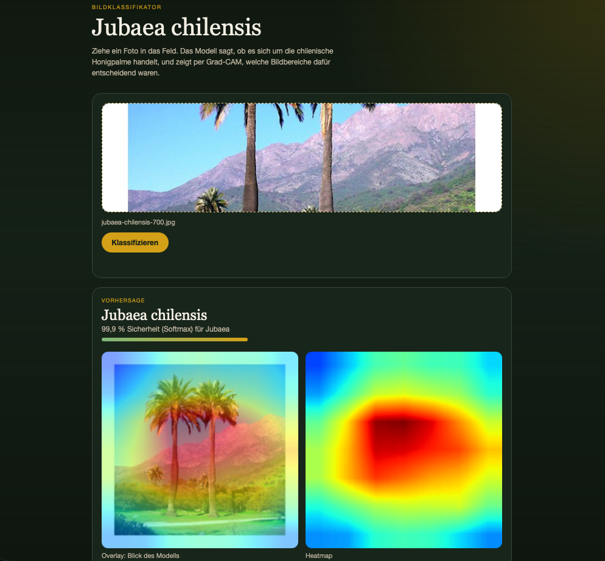
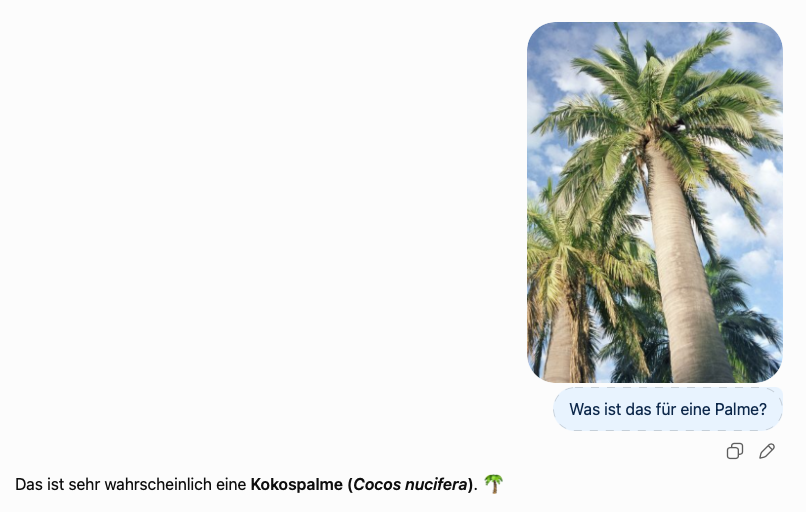
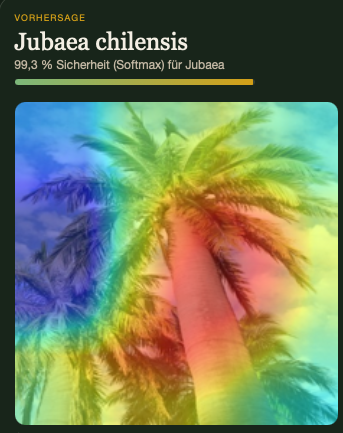
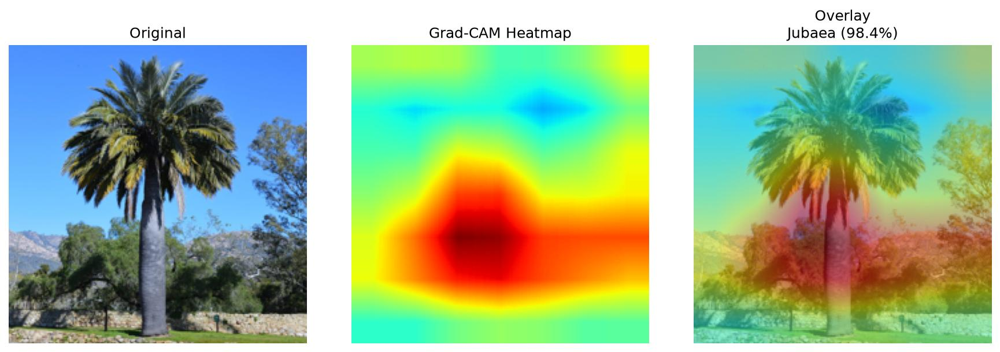
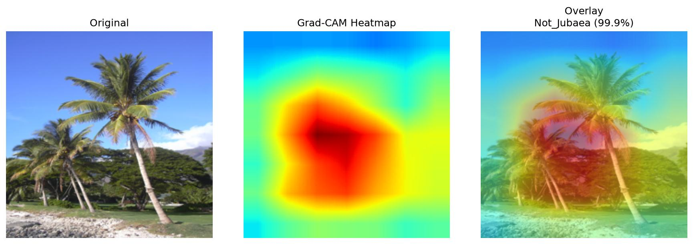
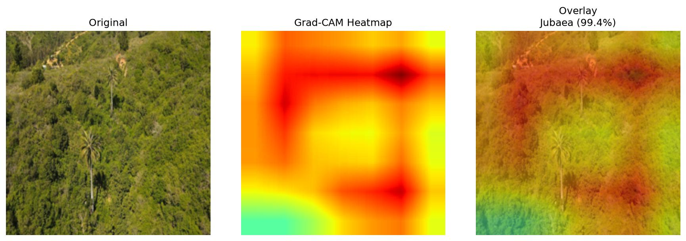

# Jubaea-Klassifikator

Ein Bildklassifikator, der erkennt, ob ein hochgeladenes Foto eine Jubaea chilensis (Chilenische Honigpalm), eine vom Aussterben bedrohte Art, zeigt.
Außerdem habe ich eine Heatmap erstellt, wodurch sichtbar wird, worauf das Modell achtet.

<p align ="left">

</p>

# Sinn des Projekts

Die chilenische Honigpalme ist eine seltene Palmenart, dessen Population stark zurückgegangen ist.
Da gewöhnliche LLM's manchmal noch Probleme haben mit dem klassifizieren, wollte ich einen eigenen zuverlässigeren Klassifizierer bauen.

<table border="0">
  <tr>
    <td>
      <br>
      <sub> Falsche Klassifizierung durch ChatGPT</sub>
    </td>
    <td>
      <br>
      <sub>Mein Modell</sub>
    </td>
  </tr>
</table>

Mein Ziel war es den kompletten Weg, vom Training bis fertiger Anwendung selbst zu bauen.

# Training
Es wurden mehrere Ansätze ausprobiert um die Testaccuracy zu erhöhen. Am Ende hat sich ResNet18 + Finetuning als beste Methode behauptet.
Alle Methoden wurden mit dem gleichen Datensatz trainiert und mit 10 Epochs. Da der Datensatz relativ klein ist, neigte das Modell beim Training etwas zu Overfitting.

| **Trainingsansatz**           | **Beschreibung**                                                            | **Testaccuracy** |
|-------------------------------|-----------------------------------------------------------------------------|------------------|
| Eigenes CNN                   | Eigenes CNN mit 3 Convolutional Layers                                      | ~80%             |
| ResNet18 mit Transferlearning | Vortrainiertes ResNet18 feingetuned                                         | ~90%             |
| ResNet18 mit Frozen Backbone  | Statt komplettes Finetuning werden alle Layer außer dem letzten eingefroren | ~60%             |


# Heatmap

Des weiteren wollte ich herausfinden, ob das Modell die Entscheidungen aus den richtigen Gründen trifft und mit welcher Confidence (Softmaxx) das Modell klassifiziert.
Es fällt auf, dass das Modell bei Bildern wo die nur die Palme zu sehen ist, auf die richtigen Merkmale achtet, zb der auffällid dicke Stamm.

<table border="0">
  <tr>
    <td>
      <br>
      <sub>True Positive Beispiel</sub>
    </td>
    <td>
      <br>
      <sub>True Negative Beispiel</sub>
    </td>
  </tr>
</table>

Dabei ist auch ein weiterer Schwachpunkt meines Modells ersichtlich geworden. Bei zb Drohnenaufnahmen bzw Umgebungen, wo die Palme zb zwischen anderen Pflanzen ist, hat dass Modell nicht aufgrund der Palme klassifiziert, sondern aufgrund der Umgebung.
Das Modell hat wahrscheinlich eher die Muster der mediteranen Vegetation gelernt, statt die Palme zu sehen.

<table border="0">
<tr>
<td>
<br>
<sub>Richtige Klassifikation, aber aus falschem Grund. Modell achtet mehr auf Umgebung als auf Palme. </sub>
</td></tr>
</table>


# Lokal ausführen

```bash
# Abhängigkeiten installieren
pip install torch torchvision flask pillow numpy matplotlib scikit-learn requests

# Web-App starten
python app.py
```

Die Anwendung erwartet ein trainiertes Modell, welches im Github hinterlegt ist (`Jubaea_with_val_resnet.pth`).
Anschließend Seite unter http://127.0.0.1:5000 aufrufen.
Auf der Seite kann man dann ein beliebiges Foto hochladen und es klassifizieren lassen.

# Herausforderungen & Learnings

- **Methodikfehler am Anfang** In einer ersten Version wurde nach jeder Epoche auf dem Testset evaluiert und bei Verbesserung gespeichert – das führt zu implizitem Overfitting auf die Testdaten. Umgestellt auf sauberes **Train/Validation/Test-Split (70/15/15)**, mit Validation während des Trainings und einmaliger finaler Testauswertung.
- **Mehr Daten > komplexeres Modell:** Die größte Verbesserung kam nicht durch Architekturänderungen, sondern durch einen größeren, saubereren Datensatz.
- **Frozen Backbone getestet und verworfen.** 
- **Modell kann noch nicht zwischen Palmen und nicht Palmen unterscheiden.** Zb werden in seltenen Fällen random Objekte als Jubaea klassifiziert

# Ausblick
Aktuell nur binärer Klassifikator. Ziel ist es den Klassifikator auf andere Palmenarten auszuweiten.